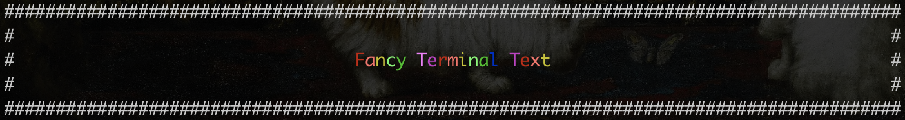

Fancy text for your Ruby based console applications. Leans on [ANSI escape codes](https://en.wikipedia.org/wiki/ANSI_escape_code) under the hood to format, colour, align and decorate text in your command line applications.

## Features

* Text formatting
  * Bold
  * Italic
  * Underline
* Colours
  * Assorted colours from the colorize gem.
  * Rainbow!
* Text alignment
  * Centre
  * Left pad
  * Right oad
* Borders
  * Wrap text in padding/borders

## Try It

```
git clone https://github.com/jsrn/fancy_terminal_text.git &&
   cd fancy_terminal_text &&
   ruby demo.rb
```
